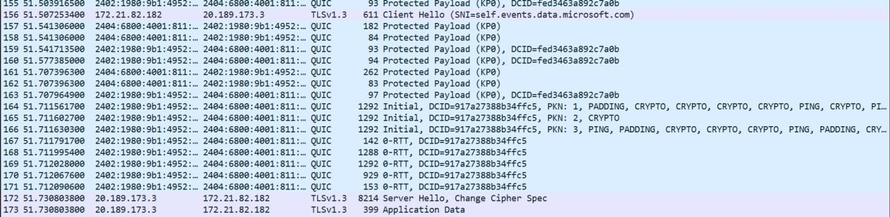
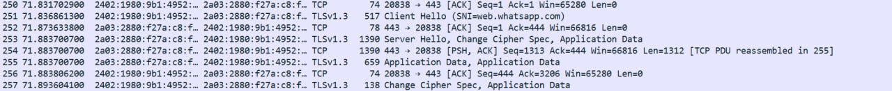

## Wireshark Packet Analysis

This activity was conducted using Wireshark to analyze network traffic.
The captured packets use protocols such as QUIC and TLSv1.3, which are commonly used for secure internet communication.
Through this task, I learned basic packet analysis and network monitoring skills.
The wireshark show the traffic by client hello and server hello. 
