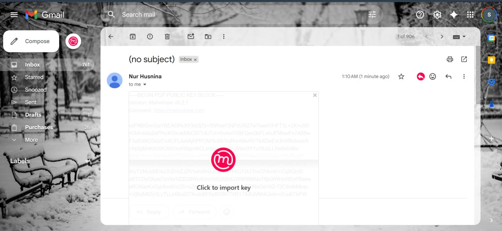

## EVIDENCE OF LEARNING

On image 1, show the conducted using Wireshark to analyze network traffic.
The captured packets use protocols such as QUIC and TLSv1.3, which are commonly used for secure internet communication.
Through this task, I learned basic packet analysis and network monitoring skills.
The wireshark show the traffic by client hello and server hello. 

On image 2, shows encrypted network communication captured using Wireshark with the TLSv1.3 protocol. 
The packets include Client Hello, Server Hello, Change Cipher Spec, and Application Data,
which are part of the secure connection process.

This shows the use of Mailvelope for email encryption through Gmail. 
The feature allows users to import a PGP public key to secure email communication and protect sensitive information.
It helps encrypt and secure email messages so that only the intended receiver can read the content safely.
